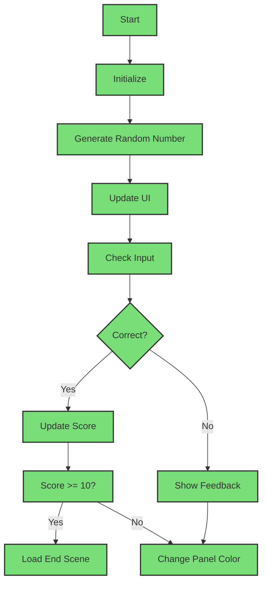
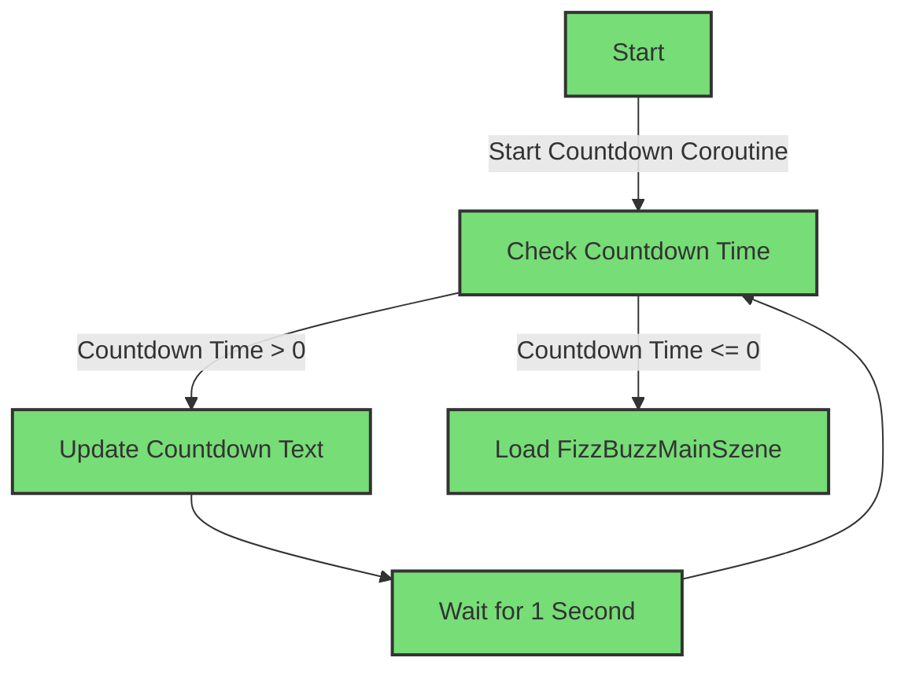

# 02-endabgabe-laugeneder3

FizzBuzzController - README

Einführung und Spielbeschreibung

FizzBuzz ist ein Lernspiel, das das Verständnis von Teilbarkeit und logischem Denken fördert. Das Spiel zeigt eine zufällige Zahl zwischen 1 und 1000 an und der Spieler muss entscheiden, ob die Zahl durch 3, 5, beide teilbar oder durch keine Zahl teilbar ist. Die möglichen Antworten sind:

    "Fizz" (wenn die Zahl durch 3 teilbar ist)
    "Buzz" (wenn die Zahl durch 5 teilbar ist)
    "FizzBuzz" (wenn die Zahl sowohl durch 3 als auch durch 5 teilbar ist)
    "nicht teilbar" (wenn die Zahl weder durch 3 noch durch 5 teilbar ist)

Das Ziel des Spiels ist es, so viele richtige Antworten wie möglich zu geben und dabei eine hohe Punktzahl zu erreichen.

Spielanleitung

Schritte zum Spielen:

    Start des Spiels:
        Das Spiel beginnt automatisch beim Starten der Anwendung.

    Anzeige der zufälligen Zahl:
        Eine zufällige Zahl zwischen 1 und 1000 wird angezeigt.

    Eingabe der Antwort:
        Der Spieler gibt seine Antwort ein, indem er eine der Tasten auf der Tastatur drückt:
        
            Linke Pfeiltaste für "Fizz"
            Rechte Pfeiltaste für "Buzz"
            Obere Pfeiltaste für "FizzBuzz"
            Untere Pfeiltaste für "nicht teilbar"

    Überprüfung der Antwort:
        Das Spiel überprüft die Eingabe des Spielers und gibt Feedback:
        
            Bei richtiger Antwort: Punktzahl wird erhöht und das Panel wechselt für kurze Zeit zu grün. Ein entsprechender Soundclip wird abgespielt.
            Bei falscher Antwort: Die korrekte Antwort wird angezeigt und das Panel wechselt für kurze Zeit zu rot. Ein entsprechender Soundclip wird abgespielt.

    Nächste Runde:
        Nach einer kurzen Verzögerung wird eine neue zufällige Zahl generiert und das Spiel setzt sich fort.
        

Code-Dokumentation
UML Diagramm

Anmerkungen zum Code

CountdownController

    Attribute:
        countdownText: TextMeshProUGUI-Element, um den Countdown anzuzeigen.
        
        countdownTime: Zeit für den Countdown (20 Sekunden).

    Methoden:
        Start(): Initialisiert den Countdown.
        
        StartCountdown(): Coroutine, die den Countdown ausführt und die FizzBuzzMainScene lädt, wenn der Countdown abgelaufen ist.
        
        LoadFizzBuzzMainScene(): Lädt die Hauptspielszene.
        

FizzBuzzController

    Attribute:
    
        RandomNumberText, UserInputText, FeedbackText, ScoreText, DivisibleBy3Text, DivisibleBy5Text: TextMeshProUGUI-Elemente zur Anzeige von Informationen.
        
        panel: Image-Element zur Anzeige von Feedback.
        
        rightSoundClip, wrongSoundClip: AudioClips für Soundeffekte.
        
        audioSource: AudioSource-Komponente zur Wiedergabe der AudioClips.
        
        randomNumber, score, userInput, canInput: Spielzustandsvariablen.

    Methoden:
    
        Start(): Initialisiert das Spiel, indem es eine neue Zufallszahl generiert und die Benutzeroberfläche aktualisiert.
        
        GenerateRandomNumber(): Generiert eine zufällige Zahl zwischen 1 und 1000.
        
        UpdateUI(): Aktualisiert die Anzeige der Zufallszahl und gibt an, ob die Zahl durch 3 oder 5 teilbar ist.
        
        UpdateUserInputText(string input): Aktualisiert den Benutzereingabetext.
        
        CheckUserInput(): Überprüft die Eingabe des Benutzers und gibt entsprechendes Feedback.
        
        PlaySound(AudioClip clip): Spielt den angegebenen Audioclip ab.
        
        ChangePanelColorAfterDelay(Color color, AudioClip clip): Ändert die Farbe des Panels nach einer kurzen Verzögerung und spielt einen Sound ab.
        
        UpdateScoreText(): Aktualisiert die Punktzahl-Anzeige.
        
        GenerateNewRandomNumber(): Generiert eine neue Zufallszahl und setzt das Spiel zurück.
        
        Update(): Überprüft die Benutzereingaben und führt die entsprechende Aktion aus.
        
        GenerateNewNumberAfterDelay(): Generiert nach einer kurzen Verzögerung eine neue Zufallszahl.
        

Szene zum Starten

Man muss sicherstellen, dass die SampleScene, die den CountdownController enthält, als Startszene in den Build-Einstellungen von Unity ausgewählt ist.

Nutzung von Makey Makey

Um Makey Makey zu verwenden, muss man die Klemmen an den entsprechenden Flächen für die einzelnen Tasten anbringen:

    Linke Pfeiltaste für "Fizz"
    Rechte Pfeiltaste für "Buzz"
    Obere Pfeiltaste für "FizzBuzz"
    Untere Pfeiltaste für "nicht teilbar"

Das Graue Kabel dass unten als Erdung angebracht ist nimmt man in die hand, wenn man nun z.B. das Kabel in die andere Hand nimmt das an der Fläche für fizz angebracht ist sollte im Spiel der Befehl Fizz ausgeführt werden.

Mit dieser Beschreibung sollte das Makey Makey nun funktionieren.

Zusammenfassung Fragebogen:

Drei Anfänger haben das FizzBuzz-Spiel getestet: ein 47-Jähriger, eine 15-Jährige und eine 17-Jährige. Alle fanden die Benutzeroberfläche einfach zu bedienen und die Anweisungen hilfreich. Der 47-Jährige war sehr motiviert bei dem Spiel, die anderen zwei waren mittel-motiviert. Zwei der Befragten fanden das Spiel unterhaltsam, während eine Befragte es nur mittel unterhaltsam fand. Zwei Teilnehmer bewerteten das Spiel als intuitiv, und eine Teilnehmerin bewertete es als sehr intuitiv.

Die 15-Jährige und die 17-Jährige fanden das Spiel nur mittel motivierend. Es gab keine Fehler, und das Feedback im Spiel war klar. Insgesamt waren alle zufrieden. Der 47-Jährige schlug vor, verschiedene Schwierigkeitslevel einzubauen.

Fehlerbehebung

Häufige Probleme

1. Keine Audioausgabe

Ich habe versucht, das Problem zu beheben, indem ich verschiedene Sachen ausprobierte. Zuerst habe ich überprüft, ob die AudioSource-Komponente auf den richtigen Objekten liegt und die korrekten AudioClips zugewiesen sind. Ich habe auch kontrolliert ob die Lautstärke auf null gesetzt ist und im Script nachgesehen ob dort fehler vorhanden sind. Nachdem ich die AudioSource-Komponente im Unity-Editor neu hinzugefügt und die AudioClips neu zugewiesen habe, funktionierte die Audioausgabe wieder.

2. Spiel reagiert nicht auf Eingaben

Ich habe überprüft, ob die Variable canInput richtig eingestellt ist. Danach habe ich die Tastenzuordnungen im Skript angeschaut, um sicherzugehen, dass sie richtig funktionieren.

